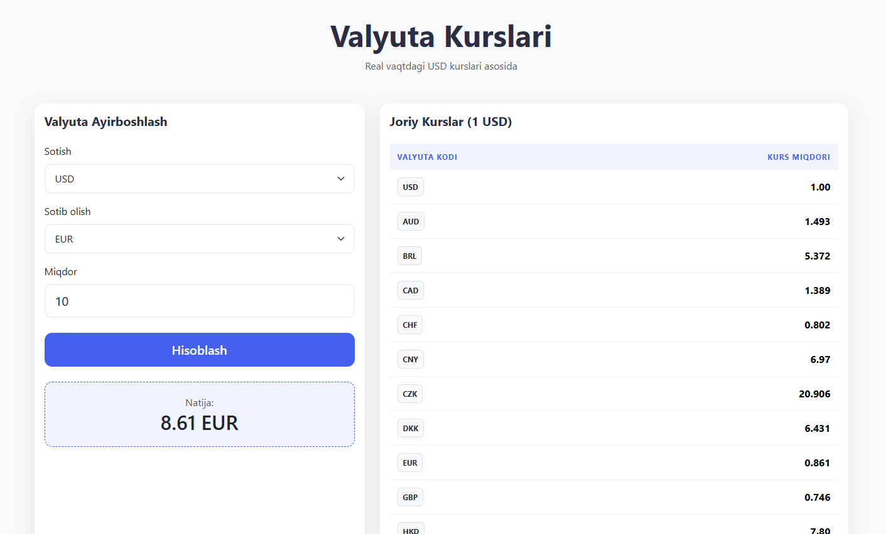

# 💱 Currency Conveyner

Zamonaviy va qulay valyuta konverteri. Loyiha real vaqtdagi valyuta kurslarini Frankfurter API orqali oladi va hisob-kitob qiladi.

## 📸 Loyiha ko'rinishi



## 🏗 Loyiha strukturasi

Repozitoriya quyidagi fayl va papkalardan tashkil topgan:

* **`css/`** — Loyihaning yig'ilgan (compiled) CSS fayllari joylashgan papka.
* **`index.html`** — Loyihaning asosiy strukturasi (Bootstrap 5 orqali).
* **`script.js`** — OOP tamoyillari asosida yozilgan JavaScript mantiqi.
* **`style.scss`** — Loyihaning dizayn va stillari (Sass/SCSS).
* **`.gitignore`** — Keraksiz fayllarni Git'ga qo'shilmasligini ta'minlaydi.
* **`photo.png`** — Loyihaning vizual ko'rinishi (ushbu README uchun).

## 🛠 Texnik imkoniyatlar

1.  **OOP (Object-Oriented Programming):** Dastur kodi `Currency`, `CurrencyConverter` va `App` klasslariga bo'lingan, bu kodni o'qish va boshqarishni osonlashtiradi.
2.  **Encapsulation:** Klasslarda `#` (private fields) ishlatilgan bo'lib, bu ma'lumotlar xavfsizligini ta'minlaydi.
3.  **Modern JS:** `async/await`, `fetch` va `destructuring` kabi ES6+ imkoniyatlaridan foydalanilgan.
4.  **SASS/SCSS:** Stillar ierarxik va o'zgaruvchilar yordamida yozilgan.

## 🚀 Ishga tushirish

1.  Repozitoriyani klon qiling:
    ```bash
    git clone [https://github.com/Asilbek2706/Currency-conveyner.git](https://github.com/Asilbek2706/Currency-conveyner.git)
    ```
2.  `index.html` faylini brauzerda oching.

## 🔗 Manbalar
* **API:** [Frankfurter API](https://www.frankfurter.dev/)
* **Framework:** [Bootstrap 5](https://getbootstrap.com/)

---
Yaratuvchi: **Asilbek2706**